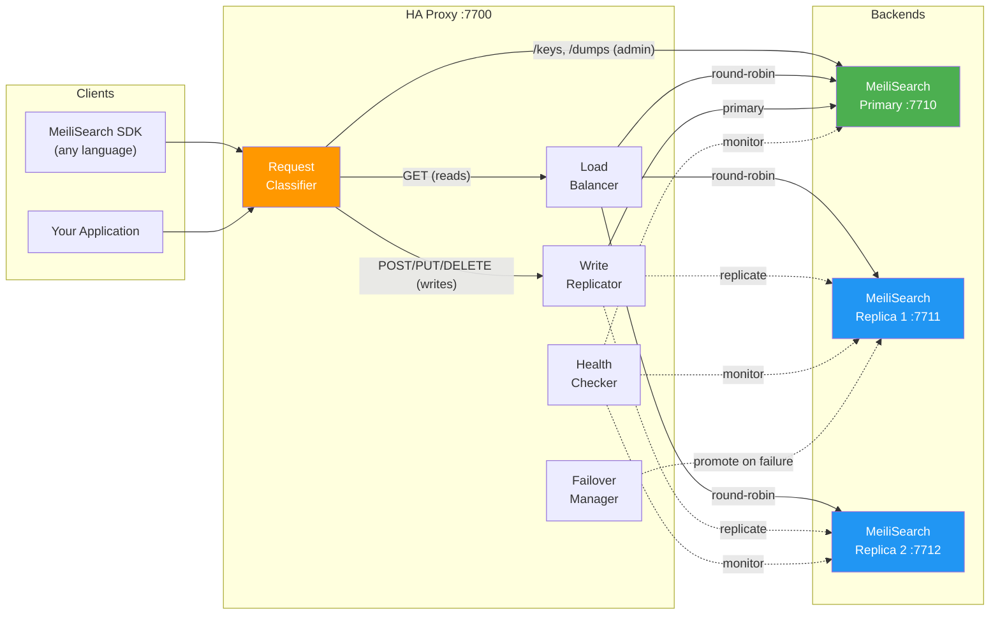
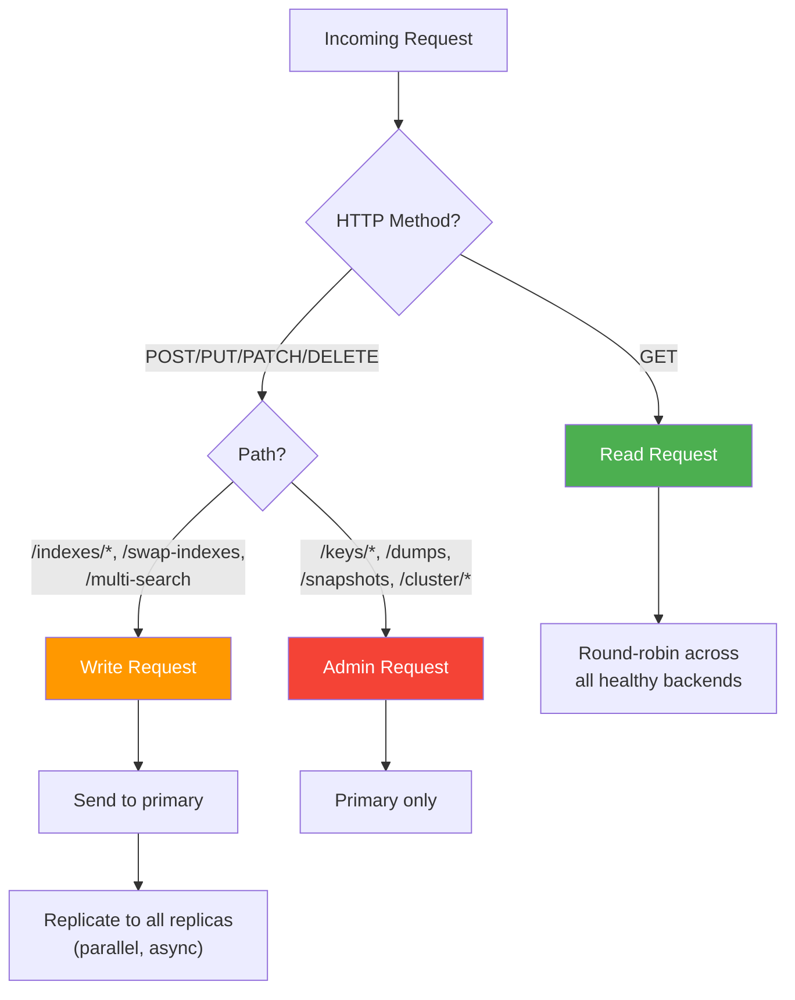

<div align="center">

# MeiliSearch HA Proxy

**High-availability reverse proxy for MeiliSearch CE**

Write replication · Automatic failover · Read load balancing

[](https://github.com/a-safe-digital/meilisearch-ha-proxy/actions/workflows/ci.yml)
[](https://github.com/a-safe-digital/meilisearch-ha-proxy/releases)
[](https://goreportcard.com/report/github.com/a-safe-digital/meilisearch-ha-proxy)
[](https://pkg.go.dev/github.com/a-safe-digital/meilisearch-ha-proxy)
[](LICENSE)

[Quick Start](#quick-start) · [Architecture](#architecture) · [Configuration](#configuration) · [Helm Chart](#helm-chart) · [Development](#development)

</div>

---

## Why

MeiliSearch CE is single-node. If it goes down, search is down. MeiliSearch Cloud and Enterprise offer HA but require a commercial license (BUSL 1.1). This proxy wraps multiple CE instances (MIT licensed) behind a single endpoint and keeps them in sync — giving you high availability without changing your MeiliSearch SDK code.

## Architecture



### Request Routing



## Features

| Feature | Description |
|---------|-------------|
| **Write Replication** | Every write is forwarded to all replicas in parallel |
| **Read Load Balancing** | Round-robin distribution across all healthy backends |
| **Automatic Failover** | Detects primary failure, promotes a replica automatically |
| **Health Monitoring** | Configurable intervals, timeouts, and thresholds |
| **Request Classification** | Smart routing based on HTTP method + path pattern |
| **Prometheus Metrics** | Exposed on a configurable metrics port |
| **Drop-in Compatible** | Works with any MeiliSearch SDK — no code changes needed |
| **Multi-arch Images** | Docker images for `linux/amd64` and `linux/arm64` |
| **Helm Chart** | One-command Kubernetes deployment |

## Quick Start

### Docker Compose

```bash
git clone https://github.com/a-safe-digital/meilisearch-ha-proxy.git
cd meilisearch-ha-proxy
make docker-up
```

```bash
# Verify
curl -s http://localhost:7700/health | jq
# {"status":"available"}

curl -s http://localhost:7700/cluster/status | jq
# Shows primary + 2 replicas, all healthy

# Create an index through the proxy
curl -s -X POST http://localhost:7700/indexes \
  -H 'Authorization: Bearer dev-master-key' \
  -H 'Content-Type: application/json' \
  -d '{"uid": "movies", "primaryKey": "id"}'

# Tear down
make docker-down
```

### Go Install

```bash
go install github.com/a-safe-digital/meilisearch-ha-proxy/cmd/meili-ha-proxy@latest
meili-ha-proxy --config config.yaml
```

### Helm (Kubernetes)

```bash
helm install meilisearch-ha-proxy \
  oci://ghcr.io/a-safe-digital/charts/meilisearch-ha-proxy \
  --version 0.1.0 \
  --set meilisearch.masterKey=your-master-key \
  --namespace search \
  --create-namespace
```

## Configuration

```yaml
# config.yaml
listen_addr: ":7700"
metrics_addr: ":9090"
api_key: "your-master-key"

backends:
  - url: "http://meili-primary:7700"
    role: primary
  - url: "http://meili-replica-1:7700"
    role: replica
  - url: "http://meili-replica-2:7700"
    role: replica

health_check:
  interval: 5s
  timeout: 2s
  unhealthy_threshold: 3
  healthy_threshold: 2

replication:
  timeout: 30s
  max_payload_size: 200MB
```

Pass the config file via `--config` flag or `MEILI_HA_CONFIG` environment variable.

### Request Routing Table

| Method | Path Pattern | Route | Description |
|--------|-------------|-------|-------------|
| `GET` | `/indexes/*`, `/multi-search`, `/health`, `/version`, `/stats` | All healthy | Round-robin load balanced |
| `POST/PUT/PATCH/DELETE` | `/indexes/*`, `/swap-indexes` | Primary + replicas | Write to primary, replicate to all |
| `ANY` | `/keys/*`, `/dumps`, `/snapshots`, `/cluster/status` | Primary only | Admin operations |

### Custom Endpoints

| Endpoint | Description |
|----------|-------------|
| `GET /health` | Proxy health — `200` if at least one backend is healthy |
| `GET /cluster/status` | Status of all backends with roles and health state |
| `GET :9090/metrics` | Prometheus metrics (on metrics port) |

## Helm Chart

The chart deploys both the HA proxy and MeiliSearch instances as StatefulSets.

```bash
# Install with custom values
helm install meilisearch-ha-proxy \
  oci://ghcr.io/a-safe-digital/charts/meilisearch-ha-proxy \
  --version 0.1.0 \
  -f my-values.yaml

# Upgrade
helm upgrade meilisearch-ha-proxy \
  oci://ghcr.io/a-safe-digital/charts/meilisearch-ha-proxy \
  --version 0.1.0 \
  -f my-values.yaml
```

See [`charts/meilisearch-ha-proxy/values.yaml`](charts/meilisearch-ha-proxy/values.yaml) for all options.

## Container Images

Multi-arch images published to GitHub Container Registry on every release and main branch push:

```bash
# Latest release (recommended for production)
docker pull ghcr.io/a-safe-digital/meilisearch-ha-proxy:v0.1.0

# Rolling main branch (development)
docker pull ghcr.io/a-safe-digital/meilisearch-ha-proxy:main

# By commit SHA
docker pull ghcr.io/a-safe-digital/meilisearch-ha-proxy:sha-abc1234
```

**Supported architectures:** `linux/amd64` · `linux/arm64`

## Development

**Prerequisites:** Go 1.24+, Docker, [golangci-lint](https://golangci-lint.run/)

```bash
make build          # Build binary for current platform
make build-all      # Cross-compile (linux+darwin, amd64+arm64)
make test           # Unit tests (~83% coverage)
make test-e2e       # E2E tests (starts docker-compose automatically)
make test-all       # All test suites
make lint           # golangci-lint
make docker-up      # Full dev stack (proxy + 3 MeiliSearch)
make docker-logs    # Follow logs
make docker-down    # Tear down
```

### Project Structure

```
cmd/meili-ha-proxy/       Entry point + CLI flags
internal/
├── config/               YAML configuration loading
├── consensus/            Raft-based leader election (future)
├── proxy/                Reverse proxy, classifier, admin handlers
├── health/               Backend health checker
├── replication/          Write replication to replicas
└── failover/             Automatic primary failover
charts/                   Helm chart (OCI published to ghcr.io)
docker/                   Dockerfiles + compose files
test/
├── e2e/                  E2E tests (meilisearch-go SDK)
├── integration/          Integration tests
└── testutil/             Shared test helpers
```

## How It Compares

| Feature | MeiliSearch CE | MeiliSearch Cloud | This Proxy + CE |
|---------|:---:|:---:|:---:|
| Search | ✅ | ✅ | ✅ |
| High Availability | ❌ | ✅ | ✅ |
| Write Replication | ❌ | ✅ | ✅ |
| Automatic Failover | ❌ | ✅ | ✅ |
| Read Load Balancing | ❌ | ✅ | ✅ |
| License | MIT | BUSL 1.1 | MIT |
| Self-hosted | ✅ | ❌ | ✅ |
| Managed | ❌ | ✅ | ❌ |

## License

[MIT](LICENSE) — use it however you want.
